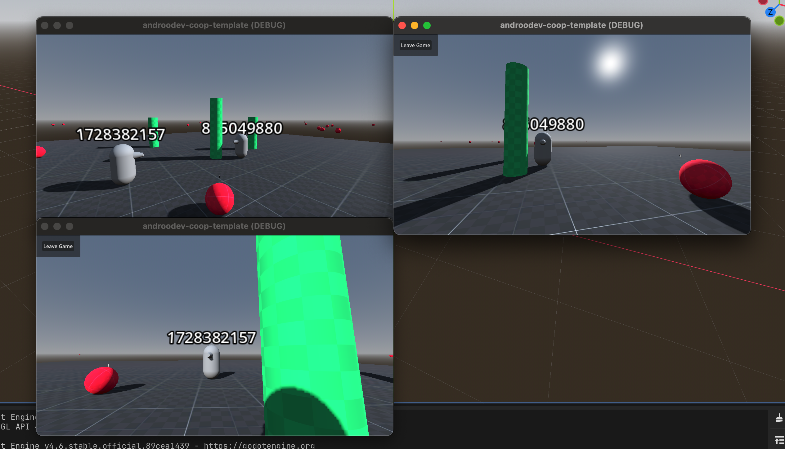
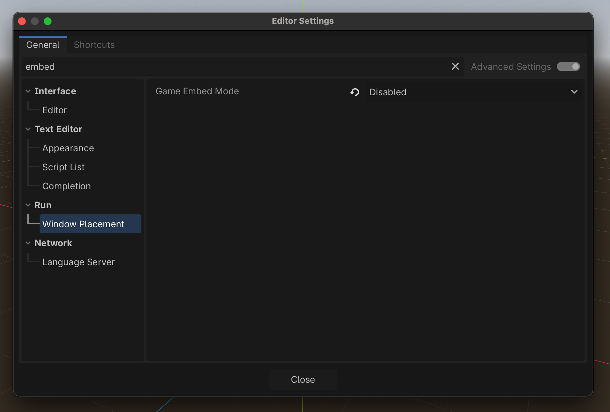
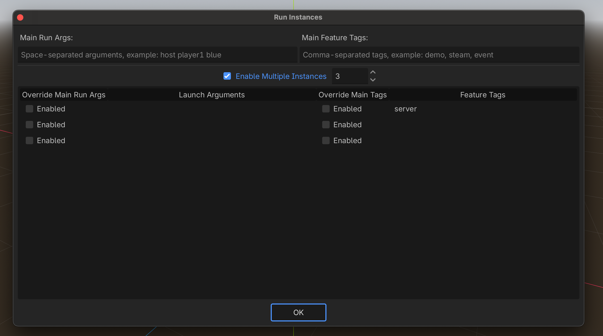

# androo-dev-co-op-multiplayer

A complete template and tutorial from [AndrooDev](https://www.youtube.com/@AndrooDev). Uses client authority to make it easy to start a PVE or Co-Op multiplayer game from scratch.

|             Twitch             |              Youtube               |
| :----------------------------: | :--------------------------------: |
| https://www.twitch.tv/andoodev | https://www.youtube.com/@AndrooDev |

## Local Development:

- Clone this project
- Import in Godot 4.6
- You may need to disable Game Embed.
  - Open Godot menu -> Select Editor Settings
  - Search Embed
  - Window Placement
  - Game Embed Mode: Disabled
- Select Debug -> Select Customize Run Instances
  - Set 3 instances
  - Add feature `server` to the first instance
- Play
  - Launched windows should tile
- You should see the server start and 2 clients
- Join on client
- Join on client

|         Game Embed Mode: Disabled         |          Customize Run Instances          |
| :---------------------------------------: | :---------------------------------------: |
|  |  |

## Controls

- WASD to Move
- Mouse to look
- Left Click to shoot ball
- Tab to open menu
